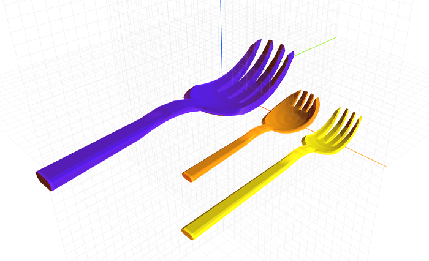

# craft-fork

Parameterized fork model.

### Install
	$ npm install craft-fork

### Parameters
- size: scales model
- length: adjusts length of fork
- spork: adjusts between fork and spork
	- 0 = fork
	- 1 = spork

### Example
```html
<craft>
	<craft name="fork" module="craft-fork"/>
	<lineup spacing = "2">
		<fork length="15" size="2"></fork>
		<fork length="20" spork="1"></fork>
		<fork></fork>
	</lineup>
</craft>
```

